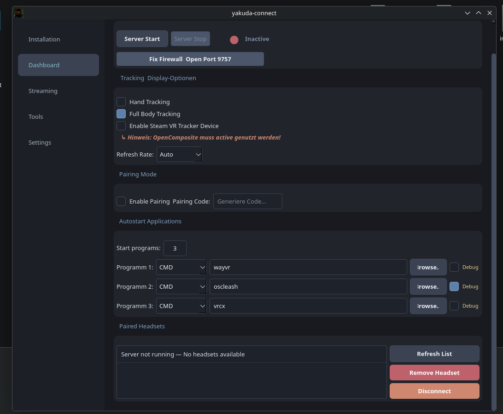

# yakuda-connect

**A sleek and intuitive GUI for WiVRn — Linux VR streaming made easy.**

`yakuda-connect` is a powerful configuration hub and dashboard designed for Arch-based Linux systems. It eliminates the need for terminal commands, allowing you to manage, configure, and launch your WiVRn environment with a single click.





---
im usiing ai claude and gemini
## Key Features

- **Centralized Dashboard:** Start and stop your WiVRn server instantly with a clean, easy-to-use interface.
- **Advanced Autostart Chain:** Don't limit yourself to just one program. Launch multiple VR companion tools (such as WayVR, VRCX, OpenComposite, SlimeVR, or OSC tools) automatically in a custom sequence.
- **One-Click Environment Setup:** Automated installation of essential WiVRn dependencies and network/firewall configuration (Port 9757).
- **Headset Client Installer:** Easily install and sideload the companion Android client (.apk) directly onto your standalone VR headset (Pico / Quest) via USB.
- **Stream Fine-Tuning:** Configure encoders, toggle OpenVR compatibility, and manage your OpenXR runtimes directly from the UI.
- **Backup & Restore:** Instantly save or recover your entire VR environment configuration.
- **Desktop Compatibility:** Runs smoothly across various desktop environments including KDE Plasma, GNOME, and Hyprland.

---

## Installation

Choose one of the two available methods to get `yakuda-connect` running on your system:

### Method 1: AppImage (Recommended & Easiest)
No installation required. Run the software completely isolated as a standalone executable.

1. Navigate to the [Releases](https://github.com/yakuda-stack/yakuda-connect/releases) section.
2. Download the latest `yakuda-connect-x86_64.AppImage`.
3. Make the file executable:
   - **Via GUI:** Right-click the file -> *Properties* -> *Permissions* -> Check **Allow executing file as program**.
   - **Via Terminal:** Run `chmod +x yakuda-connect-*.AppImage`
4. Double-click the file to launch!


### Method 2: 1 terminal command

install
terminal open 
``` 
bash <(curl -s https://raw.githubusercontent.com/yakuda-stack/yakuda-connect/main/install.sh)
```
start : 
``` 
yakuda-connect
```


### Method 3: Manual Installation (From Source)
If you prefer to run the application directly from the source code, use the following commands:

```bash
# Clone the repository
git clone [https://github.com/yakuda-stack/yakuda-connect.git](https://github.com/yakuda-stack/yakuda-connect.git)

# Enter the project directory
cd yakuda-connect

# Run the automated setup script
bash install.sh


```


**Changelog**
16.06.2026
1 : autostart by connect headset
2 : autostart writing in wivrn deltet im using my autostart funktion
3 : lange fix
17.06.2026
1 : custom ui 1 click for wayvr
2 : wayvr custom design butten for slimevr user
3 : autostart fix an kill programms on disconnect from pc


