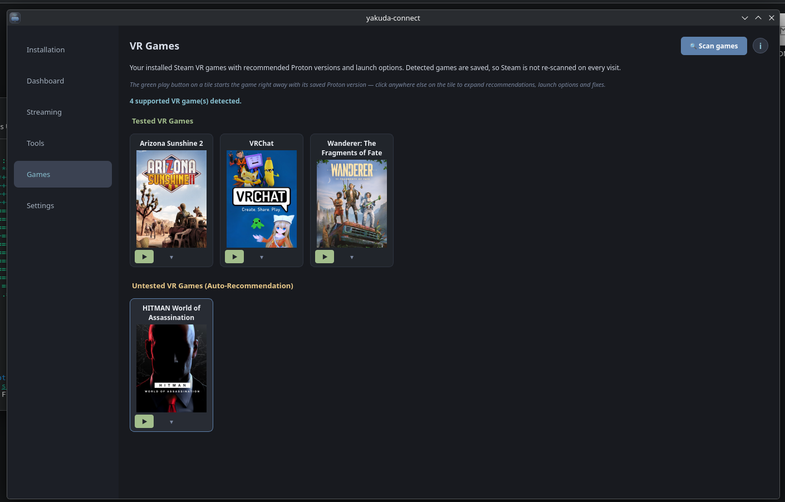
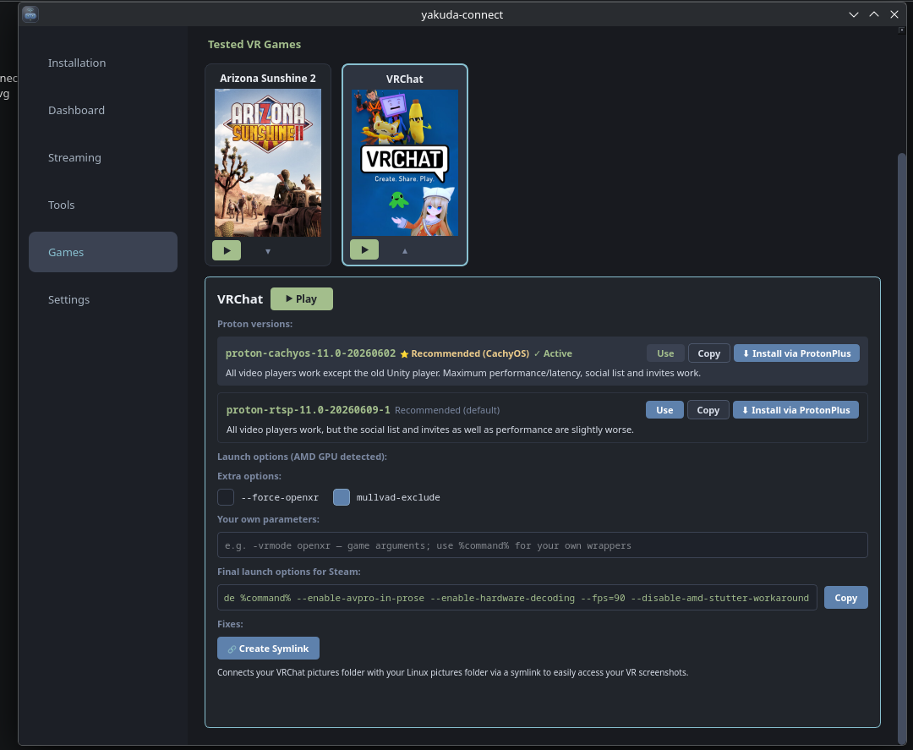
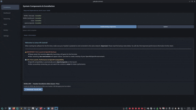

# yakuda-connect

**A sleek and intuitive GUI for WiVRn — Linux VR streaming made easy.**

[](https://discord.gg/X5TaN4A47h)
[](https://paypal.me/riesensika)
[](https://github.com/yakuda-stack/yakuda-connect/releases)

`yakuda-connect` is a powerful configuration hub and dashboard designed for Arch-based Linux systems. It eliminates the need for complex terminal commands, allowing you to manage, configure, and launch your WiVRn environment with a single click.

### 📸 Interface Preview

<table>
  <tr>
    <td><b>Dashboard</b><br></td>
    <td><b>Installation</b><br></td>
    <td><b>Streaming Settings</b><br></td>
  </tr>
  <tr>
    <td><b>Tools Hub</b><br></td>
    <td><b>General Settings</b><br></td>
    <td><b>Advanced Settings</b><br></td>
  </tr>
  <tr>
    <td><b>Tools Hub</b><br></td>
    <td><b>General Settings</b><br></td>
  </tr>
</table>
<table>
  <tr>
    <td><b>Dashboard</b><br></td>
</table>
---

## 🚀 Key Features

* **Centralized Dashboard:** Start and stop your WiVRn server instantly with a clean, easy-to-use interface.
* **VR Games Library:** The Games tab auto-detects every installed Steam VR game and shows it as a cover tile — with curated Proton profiles and tested launch options for games like VRChat, auto-recommendations for everything else, and one-click **Use** (set Proton version) and **▶ Play** (launch via Steam) buttons.
* **ProtonPlus Integration:** Install the recommended Proton builds (Proton-GE, GE-RTSP, Proton-CachyOS) straight from a game's panel via the ProtonPlus CLI.
* **Advanced Autostart Chain:** Launch multiple VR companion tools (such as WayVR, VRCX, OpenComposite, SlimeVR, or OSC tools) automatically in a custom sequence.
* **OSC Toolbox:** One-click OSC Query fix for supported OSC tools (OSC Leash, OscGoesBrrr) when VRChat OSC acts up.
* **One-Click Environment Setup:** Automated installation of essential WiVRn dependencies and network/firewall configuration (Port 9757).
* **Headset Client Installer:** Easily install and sideload the companion Android client (.apk) directly onto your standalone VR headset (Pico / Quest) via USB.
* **Stream Fine-Tuning:** Configure encoders, toggle OpenVR compatibility, and manage your OpenXR runtimes directly from the UI.
* **Backup & Restore:** Instantly save or recover your entire VR environment configuration.
* **Desktop Compatibility:** Runs smoothly across various desktop environments including KDE Plasma, GNOME, and Hyprland.

---

> 🤖 **Transparency Note:** This project and its documentation are proudly developed and optimized with the support of AI coding assistants (**Claude by Anthropic** & **Gemini**).

---

## 💬 Community & Support

yakuda-connect is a free hobby project — built by VR enthusiasts, for VR enthusiasts.

<table>
  <tr>
    <td align="center" width="50%">
      <h3>💬 Join the Discord</h3>
      <p>Questions, bug reports, feature ideas or just showing off your VR setup — our community is happy to help.</p>
      <a href="https://discord.gg/X5TaN4A47h">
        
      </a>
    </td>
    <td align="center" width="50%">
      <h3>❤️ Support the project</h3>
      <p>If yakuda-connect saved you time (or a headache), you can buy the dev a coffee. Every donation keeps Linux VR development going!</p>
      <a href="https://paypal.me/riesensika">
        
      </a>
    </td>
  </tr>
</table>

> 💡 **Tip:** Both buttons are also built right into the app — Settings → **Community & Updates**, where you can also check for new versions with one click.

---

## 📦 Installation & Setup

Whether you are a Linux newcomer or a power user, there are several straightforward ways to get `yakuda-connect` up and running.

### Method 1: AUR (Recommended for Arch, CachyOS, EndeavourOS, Manjaro)

`yakuda-connect` is available in the [AUR](https://aur.archlinux.org/packages/yakuda-connect). Install it with your favourite AUR helper — all dependencies are pulled in automatically, and you get updates through your normal system update:

```bash
yay -S yakuda-connect
```

or

```bash
paru -S yakuda-connect
```

Then launch it from your application menu or simply run:

```bash
yakuda-connect
```

### Method 2: Express Installation (AppImage & Terminal)

Choose one of the two options below to get started as quickly as possible:

#### Option A: One-Click Terminal Command (Fastest Method)
Open your terminal and paste the following command. It will automatically download the setup script, install the tool, and launch it immediately:

```bash
bash <(curl -s https://raw.githubusercontent.com/yakuda-stack/yakuda-connect/main/install.sh) && yakuda-connect
```

#### Option B: Manual AppImage (No Installation Required)
1. Navigate to the **Releases** section on GitHub[cite: 2].
2. Download the latest `yakuda-connect-x86_64.AppImage`[cite: 2].
3. Make the file executable[cite: 2]:
   - **Via GUI:** Right-click the file -> Properties -> Permissions -> Enable "Allow executing file as program"[cite: 2].
   - **Via Terminal:** `chmod +x yakuda-connect-*.AppImage`[cite: 2].
4. Double-click the file to launch the dashboard![cite: 2]

---

### Method 3: Manual Installation (From Source)

If you prefer to clone the repository and run the application directly from the source code, execute these commands in your terminal sequence:

1. Clone the repository[cite: 2]:
```bash
git clone https://github.com/yakuda-stack/yakuda-connect.git
```

2. Change to the project directory[cite: 2]:
```bash
cd yakuda-connect
```

3. Run the installation script[cite: 2]:
```bash
bash install.sh
```

---

## 📝 Changelog

The full changelog (English & German) lives in its own file:

➡️ **[CHANGELOG.md](CHANGELOG.md)**

Das vollständige Changelog (Englisch & Deutsch) liegt in einer eigenen Datei:

➡️ **[CHANGELOG.md](CHANGELOG.md)**
