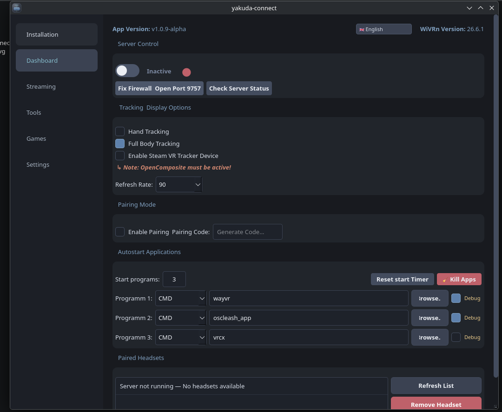
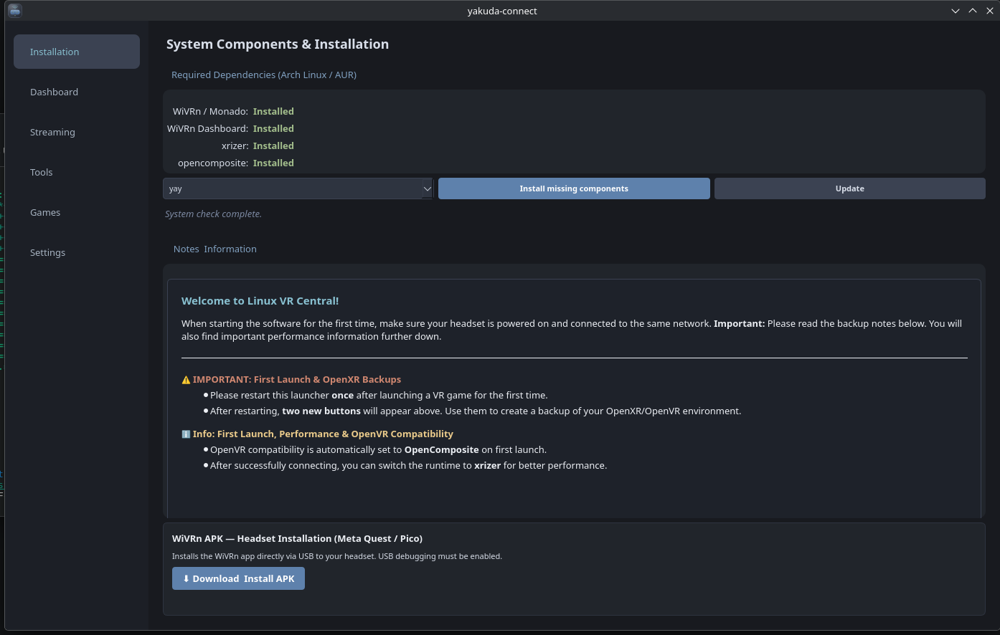
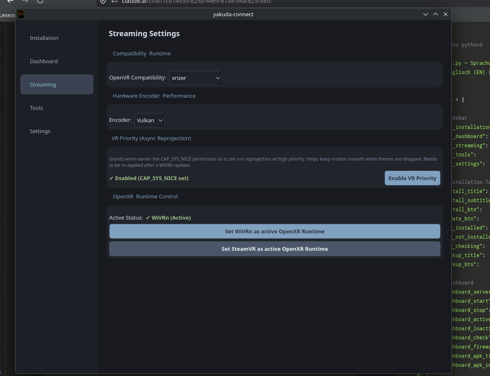
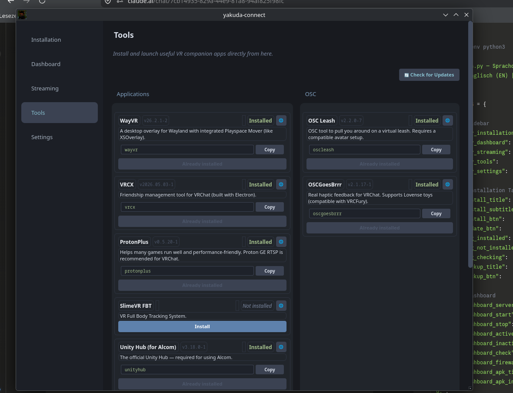
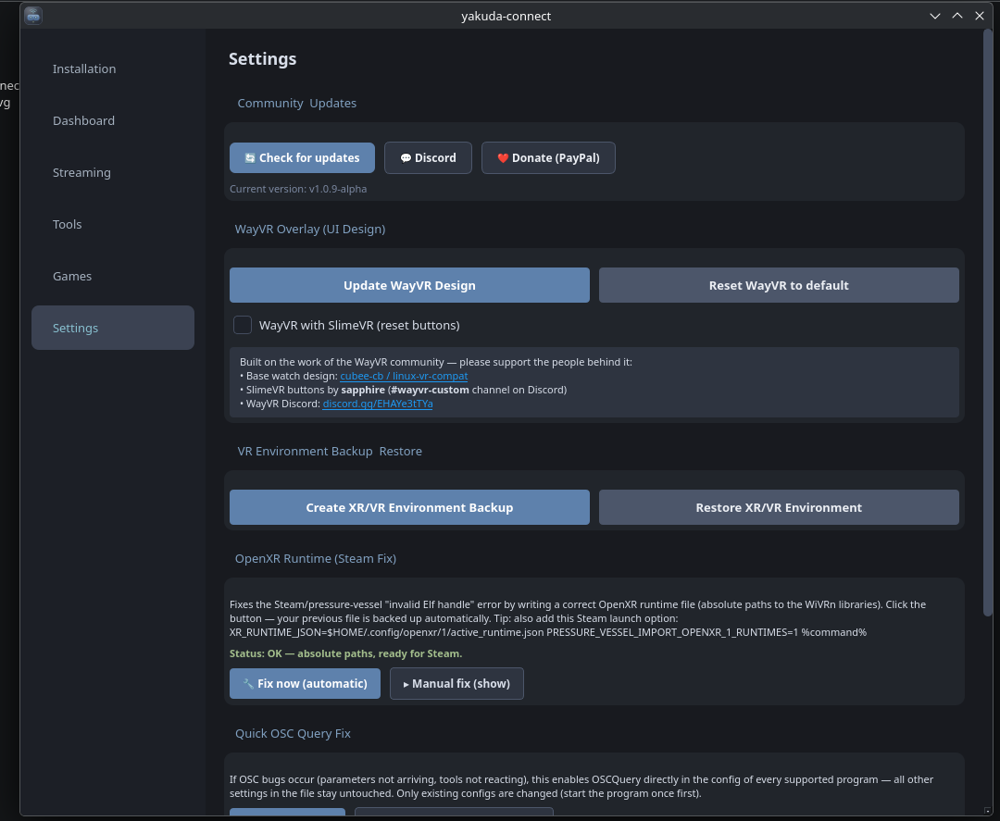
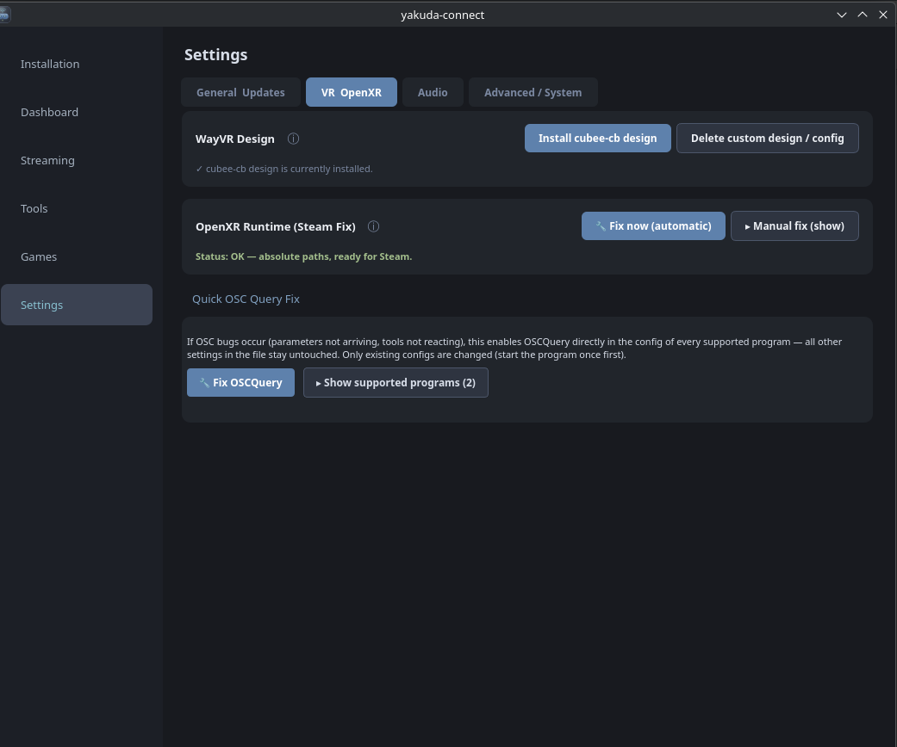

# yakuda-connect

**A sleek and intuitive GUI for WiVRn — Linux VR streaming made easy.**

`yakuda-connect` is a powerful configuration hub and dashboard designed for Arch-based Linux systems. It eliminates the need for complex terminal commands, allowing you to manage, configure, and launch your WiVRn environment with a single click.

### 📸 Interface Preview

<table>
  <tr>
    <td><b>Dashboard</b> </td>
    <td><b>Installation</b> </td>
    <td><b>Streaming Settings</b> </td>
  </tr>
  <tr>
    <td><b>Tools Hub</b> </td>
    <td><b>General Settings</b> </td>
    <td><b>Advanced Settings</b> </td>
  </tr>
</table>

---

## 🚀 Key Features

* **Centralized Dashboard:** Start and stop your WiVRn server instantly with a clean, easy-to-use interface.
* **Advanced Autostart Chain:** Launch multiple VR companion tools (such as WayVR, VRCX, OpenComposite, SlimeVR, or OSC tools) automatically in a custom sequence.
* **One-Click Environment Setup:** Automated installation of essential WiVRn dependencies and network/firewall configuration (Port 9757).
* **Headset Client Installer:** Easily install and sideload the companion Android client (.apk) directly onto your standalone VR headset (Pico / Quest) via USB.
* **Stream Fine-Tuning:** Configure encoders, toggle OpenVR compatibility, and manage your OpenXR runtimes directly from the UI.
* **Backup & Restore:** Instantly save or recover your entire VR environment configuration.
* **Desktop Compatibility:** Runs smoothly across various desktop environments including KDE Plasma, GNOME, and Hyprland.

---

## 📦 Installation & Setup

Für Linux-Einsteiger und Power-User gibt es zwei einfache Wege, das Tool zu starten.

### Method 1: Express Installation (AppImage & Terminal)

Wähle einfach eine der beiden folgenden Optionen, um am schnellsten ans Ziel zu kommen:

#### Option A: Der 1-Klick-Terminal-Befehl (Schnellste Methode)
Öffne dein Terminal und füge diesen Befehl ein. Er lädt das Skript, installiert das Tool und startet es direkt:

bash <(curl -s https://raw.githubusercontent.com/yakuda-stack/yakuda-connect/main/install.sh) && yakuda-connect

#### Option B: Manuelles AppImage (Keine Installation nötig)
1. Gehe in den Bereich "Releases" auf GitHub.
2. Lade die neueste yakuda-connect-x86_64.AppImage herunter.
3. Mach die Datei ausführbar:
   - Per GUI: Rechtsklick auf die Datei -> Eigenschaften -> Berechtigungen -> "Ausführen von Datei als Programm erlauben" aktivieren.
   - Per Terminal: chmod +x yakuda-connect-*.AppImage
4. Doppelklick auf die Datei zum Starten!

---

### Method 2: Manual Installation (From Source)
Wenn du den Quellcode selbst klonen und ausführen möchtest, führe diese Befehle nacheinander aus:

1. Repository klonen:
git clone https://github.com/yakuda-stack/yakuda-connect.git

2. In das Verzeichnis wechseln:
cd yakuda-connect

3. Skript ausführen:
bash install.sh

---

## 📝 Changelog

### 🚀 v1.0.3-alpha

#### 🇬🇧 English
* Added | VR Priority (Streaming Tab): Added an option to enable VR priority (CAP_SYS_NICE / Async Reprojection), giving the VR process higher scheduler priority for smoother streaming.
* Changed | Event-Driven Server Status: Removed the 1-second polling timer. Status updates are now purely event-based to save system resources.
* Changed | WiVRn-Driven Autostart: Companion apps are now triggered directly through WiVRn via a launcher script on headset connection. This prevents duplicate instances and eliminates background polling loops.

#### 🇩🇪 Deutsch
* Neu | VR-Priorität im Streaming-Tab: Aktivierung von VR-Priorität (CAP_SYS_NICE / Async Reprojection) für höhere Scheduler-Priorität und ruckelfreieres Streaming.
* Geändert | Ressourcenschonender Server-Status: Statusanzeige läuft nun ereignisbasiert statt über einen Sekunden-Timer (Polling).
* Geändert | Autostart über WiVRn: Programme werden direkt über ein WiVRn-Launcher-Skript beim Verbinden des Headsets gestartet. Keine doppelten Instanzen, kein Hintergrund-Polling mehr.

---

### 🚀 v1.0.2-alpha

#### 🇬🇧 English
* Added: Connect-driven autostart functionality when the headset links up.
* Added: Replaced WiVRn's default autostart routine with our optimized custom autostart engine.
* Added: Added a dedicated 1-click UI custom layout for WayVR users.
* Added: Custom WayVR design button tailored specifically for SlimeVR setups.
* Changed: General language fixes and localizations.
* Changed: Fixed autostart behavior to reliably terminate companion programs upon PC disconnection.
