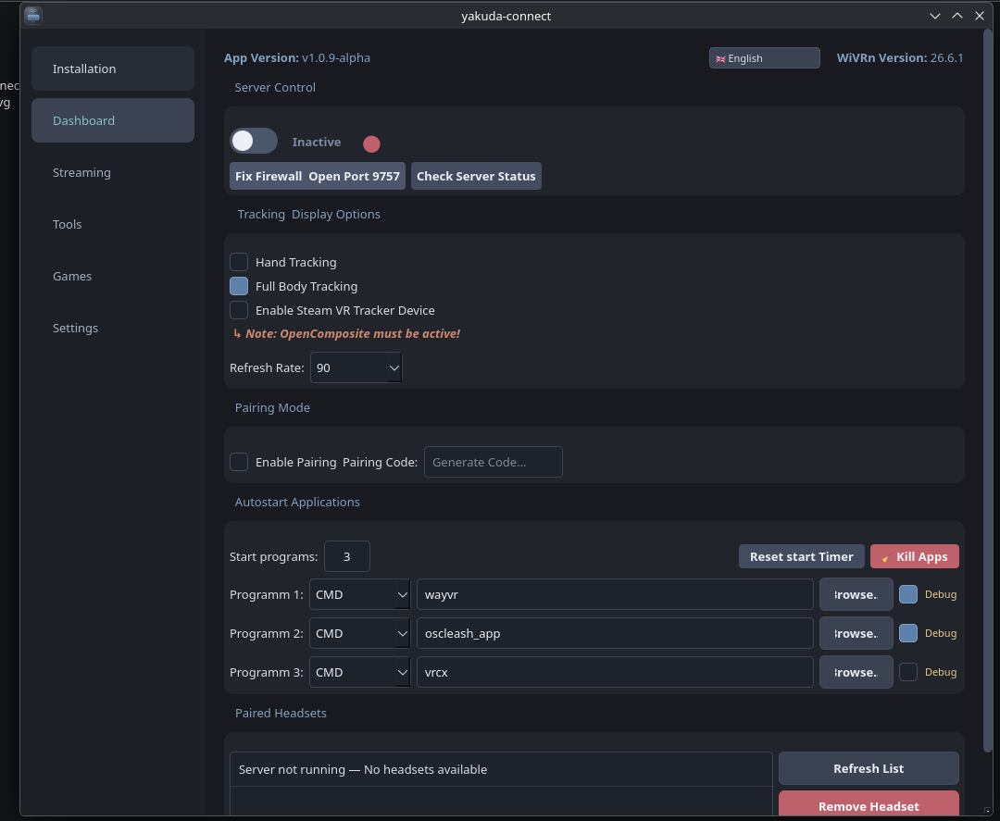
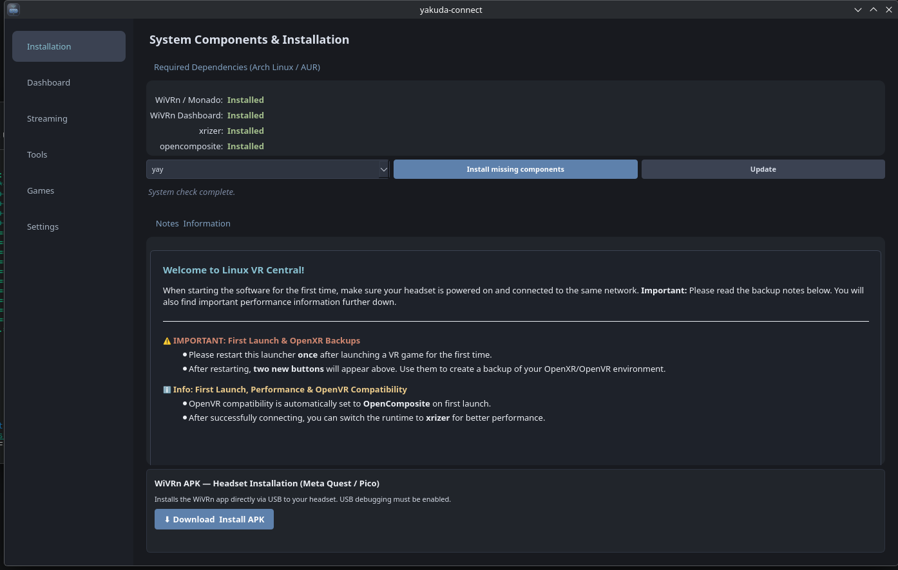
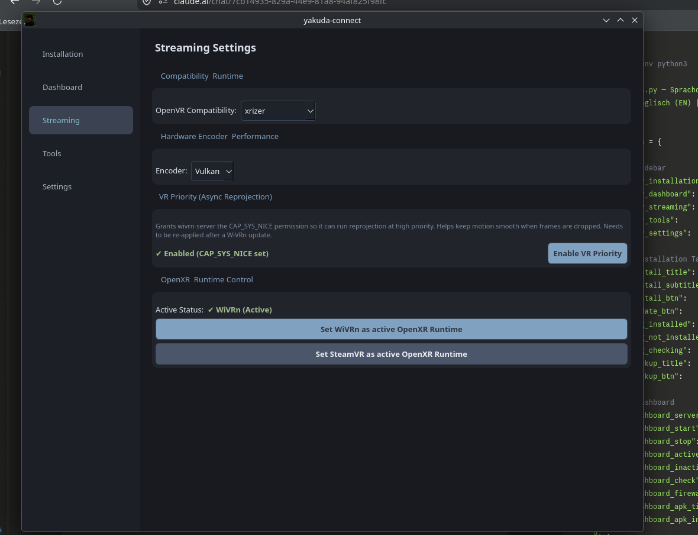
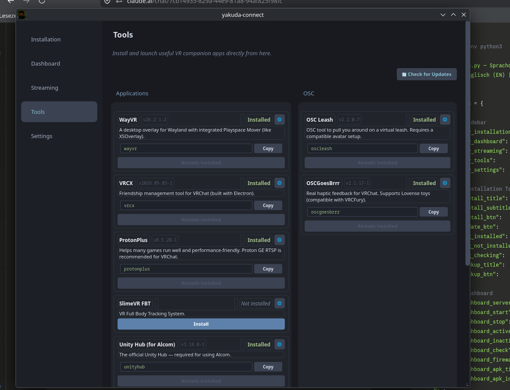
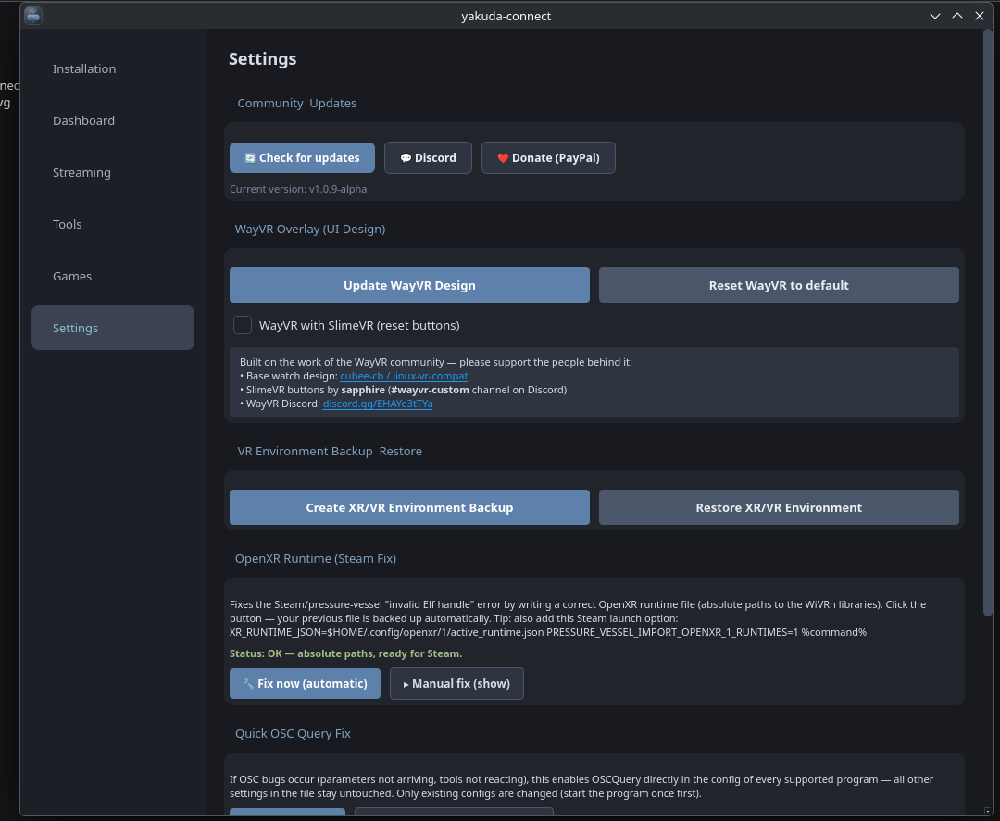
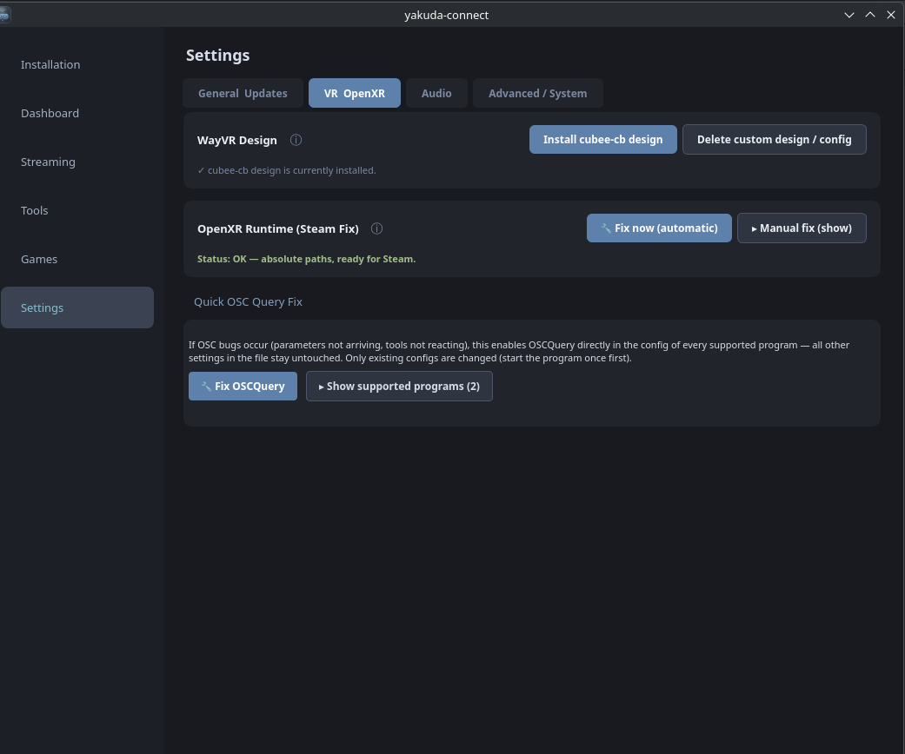
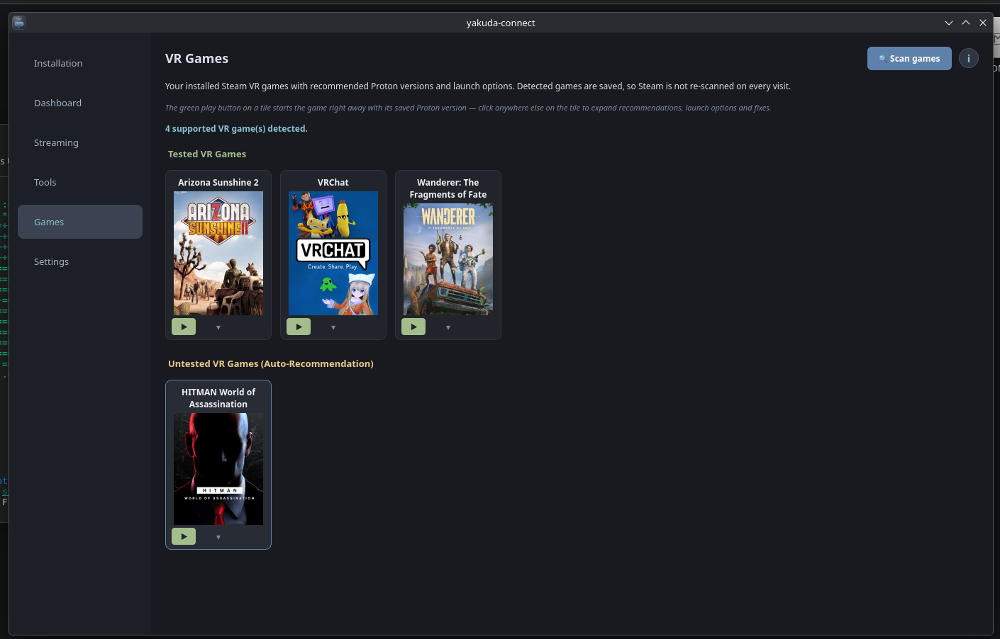
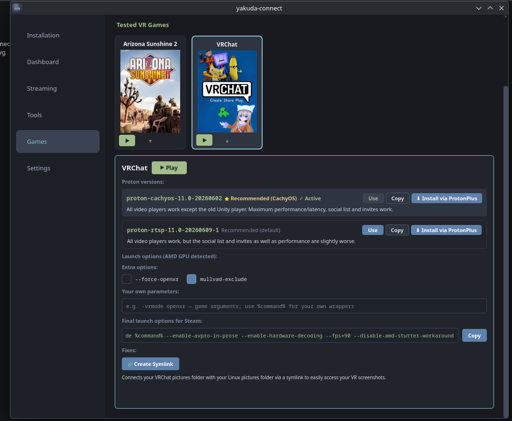
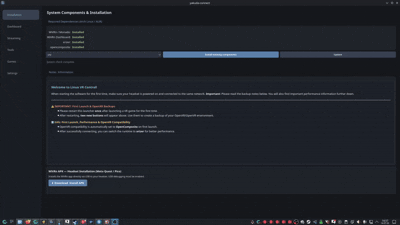

# yakuda-connect

**A sleek and intuitive GUI for WiVRn — Linux VR streaming made easy.**

[](https://discord.gg/X5TaN4A47h)
[](https://ko-fi.com/yakuda_)
[](https://github.com/yakuda-stack/yakuda-connect/releases)

`yakuda-connect` is a powerful configuration hub and dashboard designed for Arch-based Linux systems. It eliminates the need for complex terminal commands, allowing you to manage, configure, and launch your WiVRn environment with a single click.

### 📸 Interface Preview

<table>
  <tr>
    <td><b>Dashboard</b><br></td>
    <td><b>Installation</b><br></td>
    <td><b>Streaming Settings</b><br></td>
  </tr>
  <tr>
    <td><b>Tools Hub</b><br></td>
    <td><b>General Settings</b><br></td>
    <td><b>Advanced Settings</b><br></td>
  </tr>
  <tr>
    <td><b>Tools Hub</b><br></td>
    <td><b>General Settings</b><br></td>
  </tr>
</table>
<table>
  <tr>
    <td><b>Dashboard</b><br></td>
</table>
---

## 🚀 Key Features

* **Centralized Dashboard:** Start and stop your WiVRn server instantly with a clean, easy-to-use interface.
* **VR Games Library:** The Games tab auto-detects every installed Steam VR game and shows it as a cover tile — with curated Proton profiles and tested launch options for games like VRChat, auto-recommendations for everything else, and one-click **Use** (set Proton version) and **▶ Play** (launch via Steam) buttons.
* **ProtonPlus Integration:** Install the recommended Proton builds (Proton-GE, GE-RTSP, Proton-CachyOS) straight from a game's panel via the ProtonPlus CLI.
* **Advanced Autostart Chain:** Launch multiple VR companion tools (such as WayVR, VRCX, OpenComposite, SlimeVR, or OSC tools) automatically in a custom sequence.
* **OSC Toolbox:** One-click OSC Query fix for supported OSC tools (OSC Leash, OscGoesBrrr) when VRChat OSC acts up.
* **One-Click Environment Setup:** Automated installation of essential WiVRn dependencies and network/firewall configuration (Port 9757).
* **Headset Client Installer:** Easily install and sideload the companion Android client (.apk) directly onto your standalone VR headset (Pico / Quest) via USB.
* **Stream Fine-Tuning:** Configure encoders, toggle OpenVR compatibility, and manage your OpenXR runtimes directly from the UI.
* **Backup & Restore:** Instantly save or recover your entire VR environment configuration.
* **Desktop Compatibility:** Runs smoothly across various desktop environments including KDE Plasma, GNOME, and Hyprland.

---

## 🔒 Privacy & Security

Everything below is taken from the source code, and each claim names the file it can be checked against. If you find a difference between this section and the code, that is a bug — please report it.

### The short version

| Question | Answer |
| --- | --- |
| Telemetry? | **None.** No usage data, no events, no crash reporting. |
| Analytics? | **None.** No analytics SDK is present anywhere in the codebase. |
| Usage data collected? | **None.** Nothing about your usage is recorded or transmitted. |
| Data sent to a server? | **No server exists.** There is no yakuda-connect backend. |
| User account / cloud? | **Not possible.** There is no login, no account and no cloud service. |
| Unique ID / fingerprint? | **None.** Requests carry only `User-Agent: yakuda-connect` — no ID, no hardware or system information. |
| Does it open a port? | **No.** yakuda-connect never listens on a port (no socket is created anywhere in the code). |
| Where does the log go? | `~/.cache/yakuda-connect/app.log` — local only. It leaves your machine only if *you* copy or save it. |

### Outgoing network connections

These are all of them. Only the first two happen without you clicking anything.

| Host | When | Purpose | Source |
| --- | --- | --- | --- |
| `raw.githubusercontent.com` | ~1.5 s after start, automatic | Reads one file and compares its version number with the installed one | `core/install_worker.py` |
| `raw.githubusercontent.com` | ~1.5 s after start, automatic | Version of the game database (`config/games.json`) | `core/games.py` |
| `api.github.com` | Only on click | Finds the latest WiVRn release (APK) and AppImage tools | `core/main.py`, `core/appimage_installer.py` |
| `github.com` / `codeload.github.com` | Only on click | Downloads AppImages, the WayVR design, the reference backup | `core/appimage_installer.py`, `core/backup_manager.py` |
| `shared.fastly.steamstatic.com` | When opening the Games tab | Cover images for detected Steam games, cached locally | `core/games.py` |

Nothing is uploaded to any of these. Every request is a plain download.

**What is received:** release metadata (JSON) from the GitHub API, `.AppImage`/`.apk`/`.tar.gz` files you asked for, the game database, and cover images. Nothing is executed automatically after download; AppImages are verified as ELF-64 binaries before being installed (`core/vrcvideocacher_install.py`, `core/vr_environment.py`).

**No port is opened for yakuda-connect.** The firewall button opens ports for `wivrn-server` — see the table below.

### Ports

| Port | Protocol | Used by | Purpose |
| --- | --- | --- | --- |
| 9757 | TCP + UDP | `wivrn-server` | The connection between the PC and the VR headset |
| 5353 | UDP (mDNS) | `avahi` / `wivrn-server` | Lets the headset discover the PC — without it the server list in the headset stays empty even when 9757 is open |

Defined in `core/firewall.py` (`PORT`, `MDNS_PORT`). On ufw the rule is created as the named application profile `/etc/ufw/applications.d/wivrn` — byte for byte what WiVRn's own dashboard writes (`dashboard/firewall.cpp`). The name matters: WiVRn checks whether that file exists to decide if the firewall still needs setting up, so a plain `ufw allow 9757` would open the port but leave WiVRn asking for setup forever. `ports=9757` without a protocol means TCP *and* UDP in ufw. Only the firewall that is actually active is changed (firewalld or ufw). **nftables and iptables are detected but never modified automatically** — you get the commands to copy instead, because there is no reliably identical place to insert a rule and a misplaced one can take a machine off the network.

### System permissions

Only permissions the program actually uses are listed.

| Permission / access | Purpose | When | Source |
| --- | --- | --- | --- |
| Firewall rule (`pkexec`) | Open ports 9757 and 5353 so the headset can reach the WiVRn server | Only on click on "Fix Firewall" | `core/firewall.py` |
| `CAP_SYS_NICE` (`pkexec setcap`) | Lets `wivrn-server` run reprojection at high priority. A capability on one file — not a permanently elevated process | Only on click on "Enable VR Priority" | `ui/vr_runtime_widget.py` |
| `pkexec` for OpenXR config | Write `active_runtime.json` when the file or its folder belongs to root. The folder is handed back to your user afterwards, so later fixes need no root | Only as a fallback when writing without root fails | `core/openxr_manager.py` |
| `pkexec` for restore | Copy files back to `/usr/share/openxr`, `/opt/xrizer`, `/opt/opencomposite`. A timestamped backup is made first; nothing is deleted | Only on click on "Restore" | `core/backup_manager.py` |
| `sudo` in a terminal | Package installation and updates (`yay`, `paru`, `dnf`). Runs in a **visible terminal window** so you see the package list and enter the password yourself — yakuda-connect never handles your password | Only on click in the Installation tab | `core/install_worker.py` |
| Read `/sys/bus/usb/devices` | Detect a connected headset. Plain file reads, no root, no `lsusb` | Background check | `core/usb_headsets.py` |
| `adb` | Install the WiVRn APK onto the headset and detect USB debugging status. Only called when a headset was found on the bus | Only on click / when a headset is present | `core/main.py`, `core/usb_headsets.py` |

**yakuda-connect is never run as root itself.** Each of the actions above elevates a single command through `pkexec`, which shows the system's own password dialog.

### Files and configuration that can be changed

| Path | What happens | Source |
| --- | --- | --- |
| `~/.config/yakuda-connect/` | This program's own settings, backups and downloaded tools | `core/paths.py` |
| `~/.cache/yakuda-connect/` | Log file, game covers, downloaded APK | `core/paths.py` |
| `~/.config/openxr/1/active_runtime.json` | Which OpenXR runtime is active. Previous file kept as `.bak.<timestamp>` | `core/openxr_manager.py` |
| `~/.config/openvr/` | OpenVR paths (read; written by WiVRn itself) | `core/vr_environment.py` |
| `~/.config/wivrn/config.json` | WiVRn server settings (encoder, bitrate, codec, OpenVR compatibility). Read, changed key by key, written back atomically — never rebuilt | `core/config_manager.py` |
| `~/.config/wivrn/wivrn-dashboard.conf` | Only the `auto_connect_usb` key | `core/wivrn_dashboard.py` |
| `~/.config/wayvr/` | WayVR design. Backed up before every change | `core/overlay_manager.py` |
| `~/.config/OSCLeash/Config.json`, `~/.config/OscGoesBrrr/config.json` | The OSCQuery fix sets exactly one key. Files that do not exist are **not** created | `core/queryfix.py` |
| Steam `config.vdf` / `localconfig.vdf` | Proton version and launch options for a game, when you press "Use" | `core/games.py` |
| `~/.bashrc`, `~/.zshrc` | When installing an AppImage tool: appends one marked block that puts `~/.local/bin` on your `PATH`, only if it is not already there | `core/appimage_installer.py` |
| `~/.local/bin/`, `~/.local/share/applications/` | Launcher scripts and `.desktop` entries for tools you install | `core/appimage_installer.py` |
| `/usr/share/openxr`, `/opt/xrizer`, `/opt/opencomposite` | **Only** when restoring a backup, via `pkexec`, with a timestamped backup first | `core/backup_manager.py` |

### Processes that can be started or stopped

* `wivrn-server` — started and stopped from the Dashboard; output goes to `~/.cache/yakuda-connect/wivrn-server.log`
* `wivrnctl pair` — while pairing mode is active
* Autostart programs — the ones you configured yourself in the Dashboard, plus your own kill commands from Settings → Advanced (these run as a shell command, so they do exactly what you wrote)
* `adb`, `pactl`, `getcap`, `pgrep`, `systemctl` — short queries; `adb` only when a headset is connected

### Diagnostics

The log is written locally and rotates at 1 MB (3 old files kept). Settings → **General & Updates** → *Diagnostics & Log* lets you open it, copy the last part, or save a report containing the log plus version, distribution and the active OpenXR runtime. The VRChat video diagnostic deliberately redacts the resolved stream URL, because it contains your public IP and signatures (`core/vrchat_check.py`).

### Advanced Mode

The switch at the bottom left of the sidebar turns on extra technical information. When enabled, actions that change something on your system show an expandable box with a short explanation, the affected files, the required permissions and the equivalent terminal command with a copy button. **The command is never executed** — there is deliberately no "run" button. No feature behaves differently in Advanced Mode; only the information appears. The existing manual OpenXR fix stays exactly where it was.

---

## 🔒 Datenschutz & Sicherheit

Alle Angaben stammen aus dem Quellcode, und zu jeder Aussage steht die Datei dabei, in der sie überprüfbar ist. Findest du einen Unterschied zwischen diesem Abschnitt und dem Code, ist das ein Fehler — bitte melden.

### Kurzfassung

| Frage | Antwort |
| --- | --- |
| Telemetrie? | **Keine.** Keine Nutzungsdaten, keine Ereignisse, kein Absturzbericht. |
| Analytics? | **Keine.** Im gesamten Code ist kein Analytics-SDK vorhanden. |
| Werden Nutzungsdaten gesammelt? | **Nein.** Nichts über deine Nutzung wird aufgezeichnet oder übertragen. |
| Daten an einen Server? | **Es gibt keinen Server.** Ein yakuda-connect-Backend existiert nicht. |
| Konto / Cloud? | **Nicht vorhanden.** Kein Login, kein Konto, kein Cloud-Dienst. |
| Kennung / Fingerprint? | **Keine.** Anfragen tragen nur `User-Agent: yakuda-connect` — keine ID, keine Hardware- oder Systemdaten. |
| Wird ein Port geöffnet? | **Nein.** yakuda-connect lauscht auf keinem Port (im Code wird nirgends ein Socket erzeugt). |
| Wohin geht das Log? | `~/.cache/yakuda-connect/app.log` — nur lokal. Es verlässt den Rechner nur, wenn *du* es kopierst oder speicherst. |

### Ausgehende Netzwerkverbindungen

Das sind alle. Nur die ersten beiden passieren, ohne dass du etwas anklickst.

| Host | Wann | Zweck | Quelle |
| --- | --- | --- | --- |
| `raw.githubusercontent.com` | ca. 1,5 s nach dem Start, automatisch | Liest eine Datei und vergleicht die Versionsnummer darin mit der installierten | `core/install_worker.py` |
| `raw.githubusercontent.com` | ca. 1,5 s nach dem Start, automatisch | Version der Spiele-Datenbank (`config/games.json`) | `core/games.py` |
| `api.github.com` | Nur auf Klick | Findet das neueste WiVRn-Release (APK) und AppImage-Tools | `core/main.py`, `core/appimage_installer.py` |
| `github.com` / `codeload.github.com` | Nur auf Klick | Lädt AppImages, das WayVR-Design, das Referenz-Backup | `core/appimage_installer.py`, `core/backup_manager.py` |
| `shared.fastly.steamstatic.com` | Beim Öffnen des Games-Tabs | Coverbilder erkannter Steam-Spiele, lokal zwischengespeichert | `core/games.py` |

An keine dieser Adressen wird etwas hochgeladen. Jede Anfrage ist ein reiner Download.

**Was empfangen wird:** Release-Informationen (JSON) von der GitHub-API, die von dir angeforderten `.AppImage`-/`.apk`-/`.tar.gz`-Dateien, die Spiele-Datenbank und Coverbilder. Nach dem Download wird nichts automatisch ausgeführt; AppImages werden vor der Installation als ELF-64-Binärdatei geprüft (`core/vrcvideocacher_install.py`, `core/vr_environment.py`).

**Für yakuda-connect selbst wird kein Port geöffnet.** Der Firewall-Knopf gibt Ports für `wivrn-server` frei — siehe die Tabelle unten.

### Ports

| Port | Protokoll | Benutzt von | Zweck |
| --- | --- | --- | --- |
| 9757 | TCP + UDP | `wivrn-server` | Die Verbindung zwischen PC und VR-Headset |
| 5353 | UDP (mDNS) | `avahi` / `wivrn-server` | Damit das Headset den PC findet — ohne ihn bleibt die Serverliste in der Brille leer, auch wenn 9757 offen ist |

Festgelegt in `core/firewall.py` (`PORT`, `MDNS_PORT`). Bei ufw wird die Regel als benanntes Anwendungsprofil `/etc/ufw/applications.d/wivrn` angelegt — Zeichen für Zeichen das, was WiVRns eigenes Dashboard schreibt (`dashboard/firewall.cpp`). Der Name ist wichtig: WiVRn prüft, ob genau diese Datei existiert, um zu entscheiden, ob die Firewall noch eingerichtet werden muss. Ein bloßes `ufw allow 9757` würde den Port zwar öffnen, WiVRn aber dauerhaft nach einer Einrichtung fragen lassen. `ports=9757` ohne Protokollangabe bedeutet bei ufw TCP *und* UDP. Geändert wird nur die Firewall, die wirklich aktiv ist (firewalld oder ufw). **nftables und iptables werden erkannt, aber nie automatisch verändert** — dafür gibt es die Befehle zum Kopieren, denn es gibt dort keine verlässlich gleiche Stelle für eine Regel, und eine falsch eingehängte kann ein System vom Netz nehmen.

### Systemberechtigungen

Aufgeführt sind nur Berechtigungen, die das Programm tatsächlich verwendet.

| Berechtigung / Zugriff | Zweck | Wann | Quelle |
| --- | --- | --- | --- |
| Firewall-Regel (`pkexec`) | Ports 9757 und 5353 freigeben, damit das Headset den WiVRn-Server erreicht | Nur auf Klick auf „Firewall fixen" | `core/firewall.py` |
| `CAP_SYS_NICE` (`pkexec setcap`) | Lässt `wivrn-server` die Reprojection mit hoher Priorität ausführen. Eine Berechtigung an genau einer Datei — kein dauerhaft erhöhter Prozess | Nur auf Klick auf „VR-Priorität aktivieren" | `ui/vr_runtime_widget.py` |
| `pkexec` für OpenXR-Konfiguration | `active_runtime.json` schreiben, wenn die Datei oder ihr Ordner root gehört. Der Ordner wird danach an deinen Benutzer zurückgegeben, damit spätere Fixes ohne Root auskommen | Nur als Rückfall, wenn das Schreiben ohne Root scheitert | `core/openxr_manager.py` |
| `pkexec` fürs Zurückspielen | Dateien nach `/usr/share/openxr`, `/opt/xrizer`, `/opt/opencomposite` kopieren. Vorher wird mit Zeitstempel gesichert; es wird nichts gelöscht | Nur auf Klick auf „Wiederherstellen" | `core/backup_manager.py` |
| `sudo` im Terminal | Paketinstallation und Updates (`yay`, `paru`, `dnf`). Läuft in einem **sichtbaren Terminalfenster**, in dem du die Paketliste siehst und das Passwort selbst eingibst — yakuda-connect bekommt dein Passwort nie zu sehen | Nur auf Klick im Installations-Tab | `core/install_worker.py` |
| `/sys/bus/usb/devices` lesen | Angeschlossenes Headset erkennen. Reiner Dateizugriff, kein Root, kein `lsusb` | Hintergrundprüfung | `core/usb_headsets.py` |
| `adb` | WiVRn-APK auf das Headset installieren und den USB-Debugging-Status prüfen. Wird nur aufgerufen, wenn am Bus ein Headset gefunden wurde | Nur auf Klick / wenn ein Headset steckt | `core/main.py`, `core/usb_headsets.py` |

**yakuda-connect selbst läuft nie als root.** Jede der Aktionen oben hebt einen einzelnen Befehl über `pkexec` an, wobei der Passwortdialog des Systems erscheint.

### Dateien und Konfigurationen, die verändert werden können

| Pfad | Was passiert | Quelle |
| --- | --- | --- |
| `~/.config/yakuda-connect/` | Eigene Einstellungen, Backups und heruntergeladene Tools | `core/paths.py` |
| `~/.cache/yakuda-connect/` | Logdatei, Spiele-Cover, heruntergeladene APK | `core/paths.py` |
| `~/.config/openxr/1/active_runtime.json` | Welche OpenXR-Runtime aktiv ist. Bisherige Datei bleibt als `.bak.<Zeitstempel>` | `core/openxr_manager.py` |
| `~/.config/openvr/` | OpenVR-Pfade (wird gelesen; geschrieben von WiVRn selbst) | `core/vr_environment.py` |
| `~/.config/wivrn/config.json` | WiVRn-Servereinstellungen (Encoder, Bitrate, Codec, OpenVR-Kompatibilität). Wird gelesen, gezielt geändert und atomar zurückgeschrieben — nie neu aufgebaut | `core/config_manager.py` |
| `~/.config/wivrn/wivrn-dashboard.conf` | Nur der Schlüssel `auto_connect_usb` | `core/wivrn_dashboard.py` |
| `~/.config/wayvr/` | WayVR-Design. Wird vor jeder Änderung gesichert | `core/overlay_manager.py` |
| `~/.config/OSCLeash/Config.json`, `~/.config/OscGoesBrrr/config.json` | Der OSCQuery-Fix setzt genau einen Schlüssel. Nicht vorhandene Dateien werden **nicht** angelegt | `core/queryfix.py` |
| Steam `config.vdf` / `localconfig.vdf` | Proton-Version und Startparameter eines Spiels, wenn du „Use" drückst | `core/games.py` |
| `~/.bashrc`, `~/.zshrc` | Bei der Installation eines AppImage-Tools: hängt einen markierten Block an, der `~/.local/bin` in den `PATH` legt — nur, wenn er dort noch nicht ist | `core/appimage_installer.py` |
| `~/.local/bin/`, `~/.local/share/applications/` | Startskripte und `.desktop`-Einträge für Tools, die du installierst | `core/appimage_installer.py` |
| `/usr/share/openxr`, `/opt/xrizer`, `/opt/opencomposite` | **Nur** beim Zurückspielen eines Backups, über `pkexec`, mit vorheriger Sicherung samt Zeitstempel | `core/backup_manager.py` |

### Prozesse, die gestartet oder beendet werden können

* `wivrn-server` — Start und Stopp über das Dashboard; die Ausgabe landet in `~/.cache/yakuda-connect/wivrn-server.log`
* `wivrnctl pair` — während der Kopplungsmodus aktiv ist
* Autostart-Programme — die, die du selbst im Dashboard eingetragen hast, dazu deine eigenen Kill-Befehle aus Einstellungen → Advanced (sie laufen als Shell-Befehl und tun damit genau das, was du hineingeschrieben hast)
* `adb`, `pactl`, `getcap`, `pgrep`, `systemctl` — kurze Abfragen; `adb` nur, wenn ein Headset angeschlossen ist

### Diagnose

Das Log wird lokal geschrieben und rotiert bei 1 MB (3 alte Dateien bleiben erhalten). Unter Einstellungen → **Allgemein & Updates** → *Diagnose & Log* kannst du es öffnen, den letzten Teil kopieren oder einen Bericht speichern, der das Log samt Version, Distribution und aktiver OpenXR-Runtime enthält. Die VRChat-Videodiagnose kürzt die aufgelöste Stream-URL bewusst, weil sie die öffentliche IP und Signaturen enthält (`core/vrchat_check.py`).

### Advanced Mode

Der Schalter unten links in der Seitenleiste blendet zusätzliche technische Angaben ein. Ist er aktiv, zeigen Aktionen, die etwas am System ändern, einen ausklappbaren Kasten mit einer kurzen Erklärung, den betroffenen Dateien, den benötigten Berechtigungen und dem entsprechenden Terminal-Befehl samt Kopier-Knopf. **Der Befehl wird nie ausgeführt** — einen „Ausführen"-Knopf gibt es bewusst nicht. Keine Funktion verhält sich im Advanced Mode anders; es kommen nur die Informationen dazu. Der bestehende manuelle OpenXR-Fix bleibt unverändert an seiner Stelle.

---

> 🤖 **Transparency Note:** This project and its documentation are proudly developed and optimized with the support of AI coding assistants (**Claude by Anthropic** & **Gemini**).

---

## 💬 Community & Support

yakuda-connect is a free hobby project — built by VR enthusiasts, for VR enthusiasts.

<table>
  <tr>
    <td align="center" width="50%">
      <h3>💬 Join the Discord</h3>
      <p>Questions, bug reports, feature ideas or just showing off your VR setup — our community is happy to help.</p>
      <a href="https://discord.gg/X5TaN4A47h">
        
      </a>
    </td>
    <td align="center" width="50%">
      <h3>❤️ Support the project</h3>
      <p>If yakuda-connect saved you time (or a headache), you can buy the dev a coffee on Ko-fi. Every contribution keeps Linux VR development going!</p>
      <a href="https://ko-fi.com/yakuda_">
        
      </a>
    </td>
  </tr>
</table>

> 💡 **Tip:** Both buttons are also built right into the app — Settings → **Community & Updates**, where you can also check for new versions with one click.

---

## 📦 Installation & Setup

Whether you are a Linux newcomer or a power user, there are several straightforward ways to get `yakuda-connect` up and running.

### Method 1: AUR (Recommended for Arch, CachyOS, EndeavourOS, Manjaro)

`yakuda-connect` is available in the [AUR](https://aur.archlinux.org/packages/yakuda-connect). Install it with your favourite AUR helper — all dependencies are pulled in automatically, and you get updates through your normal system update:

```bash
yay -S yakuda-connect
```

or

```bash
paru -S yakuda-connect
```

Then launch it from your application menu or simply run:

```bash
yakuda-connect
```

### Method 2: Express Installation (AppImage & Terminal)

Choose one of the two options below to get started as quickly as possible:

#### Option A: One-Click Terminal Command (Fastest Method)
Open your terminal and paste the following command. It will automatically download the setup script, install the tool, and launch it immediately:

```bash
bash <(curl -s https://raw.githubusercontent.com/yakuda-stack/yakuda-connect/main/install.sh) && yakuda-connect
```

#### Option B: Manual AppImage (No Installation Required)
1. Navigate to the **Releases** section on GitHub.
2. Download `yakuda-connect-<version>-x86_64.AppImage`. One file for every
   system: it works with **FUSE 3** (Arch, CachyOS, Fedora 40+, Ubuntu 24.04+,
   Bazzite, SteamOS) **and FUSE 2** (Ubuntu 22.04 and earlier, Debian 11/12).
   `libfuse2` does **not** need to be installed — libfuse3 is linked statically
   into the file.
3. Make the file executable:
   - **Via GUI:** Right-click the file -> Properties -> Permissions -> Enable "Allow executing file as program".
   - **Via Terminal:** `chmod +x yakuda-connect-*.AppImage`
4. Double-click the file to launch the dashboard!

> **If it won't start** with an error mentioning `fusermount` or `/dev/fuse`
> (containers, hardened kernels, FUSE disabled), run it unpacked instead — this
> works on every system, it is just slightly slower to start:
> ```bash
> ./yakuda-connect-*.AppImage --appimage-extract-and-run
> ```

> **Something not working?** The app writes a log to `~/.cache/yakuda-connect/app.log`.
> Attaching it to a bug report or Discord message makes problems far easier to track down.
> For more detail, start with `YAKUDA_LOG_LEVEL=DEBUG yakuda-connect`.

---

### Method 3: Manual Installation (From Source)

If you prefer to clone the repository and run the application directly from the source code, execute these commands in your terminal sequence:

1. Clone the repository[cite: 2]:
```bash
git clone https://github.com/yakuda-stack/yakuda-connect.git
```

2. Change to the project directory[cite: 2]:
```bash
cd yakuda-connect
```

3. Run the installation script[cite: 2]:
```bash
bash install.sh
```

---

## 📝 Changelog

The full changelog (English & German) lives in its own file:

➡️ **[CHANGELOG.md](CHANGELOG.md)**

Das vollständige Changelog (Englisch & Deutsch) liegt in einer eigenen Datei:

➡️ **[CHANGELOG.md](CHANGELOG.md)**
