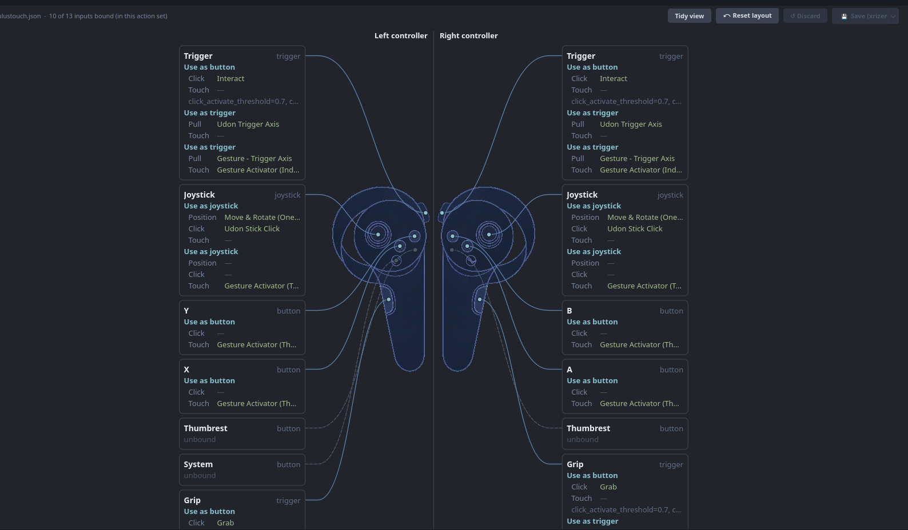
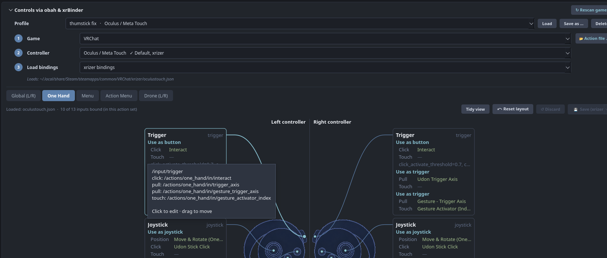

# yakuda-connect

**A sleek and intuitive GUI for WiVRn — Linux VR streaming made easy.**

[](https://discord.gg/ShNKvvZu74)
[](https://ko-fi.com/yakuda_)
[](https://github.com/yakuda-stack/yakuda-connect/releases)

`yakuda-connect` is a powerful configuration hub and dashboard for Linux VR. It eliminates the need for complex terminal commands, allowing you to manage, configure, and launch your WiVRn environment with a single click.

🎮 **Controller remapping for OpenVR *and* OpenXR games:** OpenVR games are edited via [obah](https://github.com/galister/obah), OpenXR games (e.g. Unreal games under Proton) via [xrBinder](https://gitlab.com/mittorn/xrBinder) — both in the same controller view in the Controls tab.

### 🐧 Tested systems

| System | Status | Notes |
|---|---|---|
| **Arch-based** | ✅ Tested — primary development system | Full feature set: AUR installation, all components |
| **Fedora-based** | ✅ Tested | Components come from the Fedora repos; xrizer from the COPR `@xr-sig/xrizer` or the GitHub release. The WiVRn dashboard is deliberately not offered here — yakuda-connect already provides the controls |
| **SteamOS** (Steam Deck, Desktop Mode) | 🧪 Experimental — not yet tested on real hardware | Detected automatically: WiVRn is installed as a Flatpak for your user (no password, no read-only unlock), started via `flatpak run`, settings go into the Flatpak's own config. obah / XR HOTAS can't be built there (read-only system, no compiler) — the build stops with a clear message. |
| Debian / Ubuntu / Linux Mint | ✅ Tested (Mint 22.3) | WiVRn from the Linux VR Adventures PPA (`ppa:lvra/wivrn`) where it builds, otherwise the Flathub Flatpak; xrizer straight from its GitHub release. Note: the PPA has no build for Ubuntu 24.04 `noble`, the base of Mint 22.x |

### 📸 Interface Preview

<table>
  <tr>
    <td><b>Dashboard</b><br></td>
    <td><b>Installation</b><br></td>
    <td><b>Streaming Settings</b><br></td>
  </tr>
  <tr>
    <td><b>Tools Hub</b><br></td>
    <td><b>General Settings</b><br></td>
    <td><b>Advanced Settings</b><br></td>
  </tr>
  <tr>
    <td><b>Games Library</b><br></td>
    <td><b>Game Settings</b><br></td>
    <td><b>Controls — Controller View</b><br></td>
  </tr>
  <tr>
    <td><b>Controls — Editing Bindings</b><br></td>
  </tr>
</table>
<table>
  <tr>
    <td><b>Dashboard</b><br></td>
  </tr>
</table>

All screenshots: [assets/README.md](assets/README.md)

---

## 🚀 Key Features

**In one sentence:** yakuda-connect lets you play PC VR games on Linux with a standalone headset (Meta Quest, Pico, …) over Wi-Fi or USB — and takes care of all the setup that would normally need the terminal.

### What it does for you

| | Feature | What that means in practice |
|---|---|---|
| 🥽 | **Start VR with one click** | One switch turns on the streaming server (WiVRn). Put on your headset, open the WiVRn app, connect — and start your game. |
| 🛠️ | **Sets everything up** | Installs everything VR needs on your system, opens the network port, and can put the WiVRn app onto your headset via USB cable. |
| 🎮 | **All your VR games in one place** | Finds your installed Steam VR games and shows them with cover art. Picks a working Proton version (the tool that runs Windows games on Linux) and good start options — then just press **▶ Play**. |
| 🕹️ | **Change controller buttons (bindings)** | Decide which button does what in a game — move functions to other buttons, or make tilting the stick count as a button press. Works for **both** kinds of games: **OpenVR** (older, made for SteamVR) and **OpenXR** (newer, e.g. Unreal games under Proton) — all in one picture of your controllers, no config files. |
| 🎯 | **Stop stick drift (deadzone)** | Your character walks or turns on its own? Turn up the deadzone — a small area around the stick's center that counts as “not touched”. Adjustable per stick (left, right, both) in the Controls tab, for OpenVR and OpenXR games alike. |
| 🚀 | **Start your helper apps automatically** | Apps like VRCX, WayVR or OSC tools start by themselves when your headset connects — or, with **autostart profiles** in the Streaming tab, when a specific game starts (e.g. *“when VRChat runs and the headset is on, also start VRCX”*). One after another if you like, so your game isn't slowed down while loading — and they close again afterwards. Big **Start / Stop** buttons you can easily hit from inside VR. Works with the window closed too (terminal mode). |
| 📡 | **Tune the picture** | Change stream quality, video encoder and which graphics card is used, when the image stutters or looks blurry. |
| 🧰 | **Tools hub** | Install, update and start popular Linux VR tools from one list. |
| 💾 | **Backup & restore** | Save your working VR setup and bring it back if something breaks. |
| 🎨 | **Your look** | 8 themes, own colours, background image. |
| 🌐 | **Your language** | English and German, switchable in **Settings → General**. More languages are just one file — see [locales/CONTRIBUTING.md](locales/CONTRIBUTING.md). |
| 🪶 | **Light on your PC** | Starts in under a second and uses almost no CPU while you play. Want even less? Terminal mode works without any window at all. |

<details>
<summary><b>📖 Small glossary — the words you will see</b></summary>

* **WiVRn** — the program that streams the picture from your PC to your headset.
* **OpenXR / OpenVR** — two “languages” VR games use to talk to your headset. Newer games speak OpenXR, older ones (made for SteamVR) speak OpenVR.
* **xrizer / OpenComposite** — translators that let OpenVR games run without SteamVR.
* **Proton** — lets Windows games run on Linux (part of Steam).
* **OSC** — how apps talk to VRChat (e.g. avatar effects, leash tools).
* **Autostart** — apps that start on their own. On the Dashboard: when your headset connects. As a **profile** in the Streaming tab: when a certain game runs *and* your headset is connected.

</details>

<details>
<summary><b>🔧 All features in detail (for advanced users)</b></summary>

* **Centralized Dashboard:** Start and stop your WiVRn server instantly with a clean, easy-to-use interface.
* **VR Games Library:** The Games tab auto-detects every installed Steam VR game and shows it as a cover tile — with curated Proton profiles and tested launch options for games like VRChat, auto-recommendations for everything else, and one-click **Use** (set Proton version) and **▶ Play** (launch via Steam) buttons.
* **ProtonPlus Integration:** Install the recommended Proton builds (Proton-GE, GE-RTSP, Proton-CachyOS) straight from a game's panel via the ProtonPlus CLI.
* **Advanced Autostart Chain:** Launch multiple VR companion tools (such as WayVR, VRCX, OpenComposite, SlimeVR, or OSC tools) automatically in a custom sequence.
* **Autostart profiles (Streaming tab):** The Dashboard keeps only the standard autostart (starts on headset connect; **＋ Program** / **✕** per row). Profiles live at the bottom of the Streaming tab (compatibility, encoder and GPU stay on top): master switch **Start with app profiles** (off by default), **＋ New profile** adds named profiles with a condition — *trigger runs **and** headset connected*, e.g. *when VRChat runs, start VRCX + OSC tools*. **Gap** starts the programs one after another (e.g. every 3 s) instead of all at once. Big **▶ Start programs / ■ Stop programs** buttons, easy to hit in VR (WayVR). A green dot on a tab shows that its programs are running. Pick the trigger from running programs or straight from the Games tab (**🎮 Games**, Steam games matched by AppId). Optional start delay (let the game load first) and auto-close when the trigger exits. **⏸ Stop / ▶ Start timer** per profile, **▶ Start programs** launches them by hand. Checked every 3 s via `/proc` (no extra processes; the headset check reads `/proc/net/tcp` and only runs while the trigger is up). With only the VR tab, no extra timer runs at all. In terminal mode a small background watcher (`_profile-watch`) applies the same rules while the server runs; **Start in terminal** hands running programs over, and the GUI takes them back when it starts again.
* **Controls Tab (OpenVR & OpenXR):** Switch on stick control via [XR HOTAS](https://github.com/galister/xr-hotas) or binding editing via [obah](https://github.com/galister/obah) — if a tool is missing, the app asks how to install it. Pick game, controller and bindings to load from dropdowns (preset: VRChat · Oculus/Meta Touch · xrizer), then browse every action set as a tab — both controllers drawn side by side with a line from each binding to its button, SteamVR-style. Click a button to edit its bindings (everything obah can do: add/remove bindings, mode, actions, parameters), edit poses, haptics, skeleton and chords (button combinations) in their own sections, and save as xrizer, VapoR or OpenComposite binding. Drag cards into any order — the card below moves out of the way and the gap closes — move each controller drawing on its own, swap the controller images for your own (`assets/controls`), collapse cards down to their names with **Tidy view** (or one at a time by right-clicking), and keep whole arrangements as named profiles. Unsaved changes are never lost silently: switching game or closing the app asks first.
* **OpenXR games (xrBinder):** Games that use OpenXR directly (no SteamVR bindings, e.g. Unreal games under Proton) appear in the same controller editor as OpenVR games (“Controls via obah & xrBinder”). One switch on the xrBinder card builds and enables [xrBinder](https://gitlab.com/mittorn/xrBinder) by mittorn; start the game once, then click a button and assign functions — reset per button or all at once, applied live where possible.
  * **One view for OpenVR and OpenXR:** obah (SteamVR bindings) and xrBinder (OpenXR) are separate CLI/TUI tools that don't know each other — Yakuda Connect merges them into one view; you never see which one is working.
  * **Old SteamVR games without an action file** (e.g. Gal*Gun 2): nothing for obah to edit — Yakuda Connect detects the buttons via xrizer's fixed legacy layout and remaps them through xrBinder.
  * **🧩 Use OpenXR template:** a game reports its functions but no buttons (all cards “nothing bound”, e.g. VRChat via xrizer)? One click creates a common default layout (trigger, grip, sticks, A/B/X/Y, menu) — unsaved until you press Save, “Discard” undoes it.
  * **“⇄ Tilt = press” with threshold:** replaces the popular SteamVR “dpad in touch mode” community bindings, which don't exist on Linux.
  * **Deadzone against stick drift:** click the stick → “◎ Deadzone” tab with sliders for left, right and both (0–50 %, ↺ reset each); small movements around the center count as “stick at rest”. Works for OpenVR games too when they run via xrizer or OpenComposite (xrizer itself ignores SteamVR's `deadzone_pct`).
  * **Graphical, SteamVR-style view:** both controllers side by side, lines to each button, movable cards, your own controller images, profiles.
  * **Takes care of the plumbing:** builds and patches xrBinder, registers the layer, runs the IPC service as a systemd service, reloads live only when safe, backs up foreign files.
* **Launch tools from their card:** every installed tool in the Tools tab has a **▶ Start** button — command-line tools (obah, XR HOTAS, adb) open in a terminal, everything else starts straight away.
* **Cargo Tools on any Distro:** obah and XR HOTAS are built with `cargo install` in a visible terminal; a missing C compiler, OpenXR library or Rust toolchain is installed along the way.
* **OSC Toolbox:** One-click OSC Query fix for supported OSC tools (OSC Leash, OscGoesBrrr) when VRChat OSC acts up.
* **One-Click Environment Setup:** Automated installation of essential WiVRn dependencies and network/firewall configuration (Port 9757).
* **Headset Client Installer:** Easily install and sideload the companion Android client (.apk) directly onto your standalone VR headset (Pico / Quest) via USB.
* **Stream Fine-Tuning:** Configure encoders, pick the graphics card WiVRn runs on (handy when an integrated GPU keeps winning the Vulkan lottery), toggle OpenVR compatibility, and manage your OpenXR runtimes directly from the UI.
* **Backup & Restore:** Instantly save or recover your entire VR environment configuration.
* **Customizable Interface:** Eight built-in themes plus per-role colour pickers, an optional background image and adjustable card opacity — under Settings → **Design**.
* **Light on resources:** starts in well under a second, builds the Tools tab only when you open it, no app-wide event filter, no UI freeze while checking packages and next to no CPU at idle — stays out of the way while you're in VR.
* **Terminal mode (no GUI, no Qt):** saves RAM in VR. Commands: `YC-help`, `YC-status`, `YC-wivrn-toggle` (server on/off), `YC-openvr`, `YC-encoder`, `YC-GPU`, `YC-killapps` (close autostart programs), `YC-autostart-reset` (reset start timer), `YC-pairing` (shows the PIN), autostart profiles included (`YC-status` shows them) — pick by number, or directly (`YC-encoder vaapi`, `YC-GPU 1`). Included with AUR and the curl installer; for AppImage/source use Settings → Advanced → **Set up commands**. **Start in terminal** opens the menu and closes the GUI (the server keeps running). Autostart programs work here too: they start once the headset connects.
* **Desktop Compatibility:** Runs smoothly across various desktop environments including KDE Plasma, GNOME, and Hyprland.

</details>
---

## 📦 Installation & Setup

Whether you are a Linux newcomer or a power user, there are several straightforward ways to get `yakuda-connect` up and running.

### Method 1: AUR (Recommended for Arch, CachyOS, EndeavourOS, Manjaro)

`yakuda-connect` is available in the [AUR](https://aur.archlinux.org/packages/yakuda-connect). Install it with your favourite AUR helper — all dependencies are pulled in automatically, and you get updates through your normal system update:

```bash
yay -S yakuda-connect
```

or

```bash
paru -S yakuda-connect
```

Then launch it from your application menu or simply run:

```bash
yakuda-connect
```

### Method 2: Fedora, Debian, Ubuntu and Linux Mint

The setup script detects the package manager itself (pacman, dnf, apt, zypper) and installs PySide6 from the matching distribution package; if there is none, it builds its own venv, touching neither the system Python nor PEP 668:

```bash
bash <(curl -s https://raw.githubusercontent.com/yakuda-stack/yakuda-connect/main/install.sh) && yakuda-connect
```

The VR components themselves are then installed from within the app (Installation tab). On Fedora they come from the official repos; xrizer is available from the COPR `@xr-sig/xrizer` or, as an alternative, straight from the GitHub release — selectable per component.

### Method 3: Express Installation (AppImage & Terminal)

Choose one of the two options below to get started as quickly as possible:

#### Option A: One-Click Terminal Command (Fastest Method)
Open your terminal and paste the following command. It will automatically download the setup script, install the tool, and launch it immediately:

```bash
bash <(curl -s https://raw.githubusercontent.com/yakuda-stack/yakuda-connect/main/install.sh) && yakuda-connect
```

#### Option B: Manual AppImage (No Installation Required)
1. Navigate to the **Releases** section on GitHub.
2. Download `yakuda-connect-<version>-x86_64.AppImage`. One file for every
   system: it works with **FUSE 3** (Arch, CachyOS, Fedora 40+, Ubuntu 24.04+,
   Bazzite, SteamOS) **and FUSE 2** (Ubuntu 22.04 and earlier, Debian 11/12).
   `libfuse2` does **not** need to be installed — libfuse3 is linked statically
   into the file.
3. Make the file executable:
   - **Via GUI:** Right-click the file -> Properties -> Permissions -> Enable "Allow executing file as program".
   - **Via Terminal:** `chmod +x yakuda-connect-*.AppImage`
4. Double-click the file to launch the dashboard!

> **If it won't start** with an error mentioning `fusermount` or `/dev/fuse`
> (containers, hardened kernels, FUSE disabled), run it unpacked instead — this
> works on every system, it is just slightly slower to start:
> ```bash
> ./yakuda-connect-*.AppImage --appimage-extract-and-run
> ```

> **Something not working?** The app writes a log to `~/.cache/yakuda-connect/app.log`.
> Attaching it to a bug report or Discord message makes problems far easier to track down.
> For more detail, start with `YAKUDA_LOG_LEVEL=DEBUG yakuda-connect`.

---

### Method 4: Manual Installation (From Source)

If you prefer to clone the repository and run the application directly from the source code, execute these commands in your terminal sequence:

1. Clone the repository[cite: 2]:
```bash
git clone https://github.com/yakuda-stack/yakuda-connect.git
```

2. Change to the project directory[cite: 2]:
```bash
cd yakuda-connect
```

3. Run the installation script[cite: 2]:
```bash
bash install.sh
```

---

## 🔒 Privacy & Security

Everything below is taken from the source code, and each claim names the file it can be checked against. If you find a difference between this section and the code, that is a bug — please report it.

### The short version

| Question | Answer |
| --- | --- |
| Telemetry? | **None.** No usage data, no events, no crash reporting. |
| Analytics? | **None.** No analytics SDK is present anywhere in the codebase. |
| Usage data collected? | **None.** Nothing about your usage is recorded or transmitted. |
| Data sent to a server? | **No server exists.** There is no yakuda-connect backend. |
| User account / cloud? | **Not possible.** There is no login, no account and no cloud service. |
| Unique ID / fingerprint? | **None.** Requests carry only `User-Agent: yakuda-connect` — no ID, no hardware or system information. |
| Does it open a port? | **No.** yakuda-connect never listens on a port (no socket is created anywhere in the code). |
| Where does the log go? | `~/.cache/yakuda-connect/app.log` — local only. It leaves your machine only if *you* copy or save it. |

### Outgoing network connections

These are all of them. Only the first two happen without you clicking anything.

| Host | When | Purpose | Source |
| --- | --- | --- | --- |
| `raw.githubusercontent.com` | ~1.5 s after start, automatic | Reads one file and compares its version number with the installed one | `core/install_worker.py` |
| `raw.githubusercontent.com` | ~1.5 s after start, automatic | Version of the game database (`config/games.json`) | `core/games.py` |
| `api.github.com` | Only on click | Finds the latest WiVRn release (APK), AppImage tools and the newest xrizer release; latest XR HOTAS commit for the update check (only if `git` is not installed — otherwise `git ls-remote` against `github.com`) | `core/main.py`, `core/appimage_installer.py`, `core/xrizer_github.py`, `core/cargo_installer.py` |
| `crates.io` | Only on click on "Check for Updates" | Latest published version of obah (JSON, one request) | `core/cargo_installer.py` |
| `ppa.launchpadcontent.net` | Only on click, apt systems only | Checks whether the WiVRn PPA has a build for this Ubuntu release before adding it (HEAD request, no download) | `core/appimage_installer.py` |
| `github.com` / `codeload.github.com` | Only on click | Downloads AppImages, the WayVR design, the reference backup, the xrizer release ZIP (into `~/.local/share/xrizer`, no root) | `core/appimage_installer.py`, `core/backup_manager.py`, `core/xrizer_github.py` |
| `shared.fastly.steamstatic.com` | When opening the Games tab | Cover images for detected Steam games, cached locally | `core/games.py` |
| `index.crates.io`, `static.crates.io`, `github.com` | Only when installing via **Cargo**, inside the visible terminal | `cargo` downloads the source of obah (crates.io) or XR HOTAS (GitHub) and their dependencies | `core/cargo_installer.py` |
| `sh.rustup.rs`, `static.rust-lang.org` | Only when installing via **Cargo** and Rust is missing or too old (not on Arch/Fedora, which use their own packages) | Official rustup installer and Rust toolchain, installed for your user only | `core/cargo_installer.py` |

Nothing is uploaded to any of these. Every request is a plain download.

**What is received:** release metadata (JSON) from the GitHub API, `.AppImage`/`.apk`/`.tar.gz` files you asked for, the game database, and cover images. Nothing is executed automatically after download; AppImages are verified as ELF-64 binaries before being installed (`core/vrcvideocacher_install.py`, `core/vr_environment.py`). The one exception is the **Cargo** install method, and only after you pick it: it compiles the downloaded source and — if Rust is missing — runs the official rustup install script. All of that happens in a visible terminal, logged to `install.log` in the tool's folder.

**No port is opened for yakuda-connect.** The firewall button opens ports for `wivrn-server` — see the table below.

### Ports

| Port | Protocol | Used by | Purpose |
| --- | --- | --- | --- |
| 9757 | TCP + UDP | `wivrn-server` | The connection between the PC and the VR headset |
| 5353 | UDP (mDNS) | `avahi` / `wivrn-server` | Lets the headset discover the PC — without it the server list in the headset stays empty even when 9757 is open |

Defined in `core/firewall.py` (`PORT`, `MDNS_PORT`). On ufw the rule is created as the named application profile `/etc/ufw/applications.d/wivrn` — byte for byte what WiVRn's own dashboard writes (`dashboard/firewall.cpp`). The name matters: WiVRn checks whether that file exists to decide if the firewall still needs setting up, so a plain `ufw allow 9757` would open the port but leave WiVRn asking for setup forever. `ports=9757` without a protocol means TCP *and* UDP in ufw. Only the firewall that is actually active is changed (firewalld or ufw). **nftables and iptables are detected but never modified automatically** — you get the commands to copy instead, because there is no reliably identical place to insert a rule and a misplaced one can take a machine off the network.

### System permissions

Only permissions the program actually uses are listed.

| Permission / access | Purpose | When | Source |
| --- | --- | --- | --- |
| Firewall rule (`pkexec`) | Open ports 9757 and 5353 so the headset can reach the WiVRn server | Only on click on "Fix Firewall" | `core/firewall.py` |
| `CAP_SYS_NICE` (`pkexec setcap`) | Lets `wivrn-server` run reprojection at high priority. A capability on one file — not a permanently elevated process | Only on click on "Enable VR Priority" | `ui/vr_runtime_widget.py` |
| `pkexec` for OpenXR config | Write `active_runtime.json` when the file or its folder belongs to root. The folder is handed back to your user afterwards, so later fixes need no root | Only as a fallback when writing without root fails | `core/openxr_manager.py` |
| `pkexec` for restore | Copy files back to `/usr/share/openxr`, `/opt/xrizer`, `/opt/opencomposite`. A timestamped backup is made first; nothing is deleted | Only on click on "Restore" | `core/backup_manager.py` |
| `sudo` in a terminal | Package installation and updates (`yay`, `paru`, `dnf`). Runs in a **visible terminal window** so you see the package list and enter the password yourself — yakuda-connect never handles your password | Only on click in the Installation tab | `core/install_worker.py` |
| `sudo` in a terminal (Cargo method) | Installs what the build needs if missing: a C compiler, the OpenXR library for XR HOTAS, and Rust itself on Arch/Fedora (`pacman`, `dnf`, `apt-get`, `zypper`). Same visible terminal, your own password prompt. The build itself runs **without** root | Only on click, when installing via Cargo in the Tools or Controls tab | `core/cargo_installer.py` |
| Read `/sys/bus/usb/devices` | Detect a connected headset. Plain file reads, no root, no `lsusb` | Background check | `core/usb_headsets.py` |
| `adb` | Install the WiVRn APK onto the headset and detect USB debugging status. Only called when a headset was found on the bus | Only on click / when a headset is present | `core/main.py`, `core/usb_headsets.py` |

**yakuda-connect is never run as root itself.** Each of the actions above elevates a single command through `pkexec`, which shows the system's own password dialog.

### Files and configuration that can be changed

| Path | What happens | Source |
| --- | --- | --- |
| `~/.config/yakuda-connect/` | This program's own settings, backups and downloaded tools | `core/paths.py` |
| `~/.cache/yakuda-connect/` | Log file, game covers, downloaded APK | `core/paths.py` |
| `~/.config/openxr/1/active_runtime.json` | Which OpenXR runtime is active. Previous file kept as `.bak.<timestamp>` | `core/openxr_manager.py` |
| `~/.config/openvr/` | OpenVR paths (read; written by WiVRn itself) | `core/vr_environment.py` |
| `~/.config/wivrn/config.json` | WiVRn server settings (encoder, bitrate, codec, OpenVR compatibility). Read, changed key by key, written back atomically — never rebuilt | `core/config_manager.py` |
| `~/.config/wivrn/wivrn-dashboard.conf` | Only the `auto_connect_usb` key | `core/wivrn_dashboard.py` |
| `~/.config/wayvr/` | WayVR design. Backed up before every change | `core/overlay_manager.py` |
| `~/.config/OSCLeash/Config.json`, `~/.config/OscGoesBrrr/config.json` | The OSCQuery fix sets exactly one key. Files that do not exist are **not** created | `core/queryfix.py` |
| Steam `config.vdf` / `localconfig.vdf` | Proton version and launch options for a game, when you press "Use" | `core/games.py` |
| `~/.bashrc`, `~/.zshrc` | When installing an AppImage tool: appends one marked block that puts `~/.local/bin` on your `PATH`, only if it is not already there | `core/appimage_installer.py` |
| `~/.local/bin/`, `~/.local/share/applications/` | Launcher scripts and `.desktop` entries for tools you install | `core/appimage_installer.py` |
| `~/.config/yakuda-connect/tools/cargo/<tool>/` | Cargo-built tools (obah, XR HOTAS): the binary, `install.sh` and `install.log`. "Remove" deletes the folder and its link in `~/.local/bin` | `core/cargo_installer.py` |
| `~/.cargo/`, `~/.rustup/`, `~/.profile`, `~/.bashrc`, `~/.zshenv` | **Only** if the Cargo method has to install Rust via rustup: the toolchain lands in `~/.cargo` and `~/.rustup`, and rustup adds one line to your shell profiles that puts `~/.cargo/bin` on your `PATH` (rustup's standard behaviour). Removing a Cargo tool leaves Rust installed | `core/cargo_installer.py` |
| Steam game folders | The obah section of the Controls tab looks for OpenVR action files and existing `xrizer/`, `OpenComposite/` and `vapor_binding.json` bindings and reads them to display them. **Written only when you press Save**: `<game>/xrizer/<controller>.json`, `<game>/OpenComposite/<controller>.json` or `<game>/vapor_binding.json` — the same files obah writes, including the `poses`, `skeleton`, `haptics` and `chords` sections. An existing file is first copied to `<name>.bak` | `core/obah_bindings.py`, `core/obah_editor.py` |
| `~/.config/yakuda-connect/config/controls_layout.json` | The order of the binding cards and where you moved the controller drawings in the Controls tab, per controller and hand | `core/tabs/controls_mixin.py` |
| `~/.config/yakuda-connect/config/controls_profiles.json` | Your named Controls profiles: under each name the arrangement, the complete binding, the controller type and the name of the game it came from. No paths from your library. Written only when you press "Save as …", removed again by "Delete" | `core/tabs/controls_mixin.py` |
| `/usr/share/openxr`, `/opt/xrizer`, `/opt/opencomposite` | **Only** when restoring a backup, via `pkexec`, with a timestamped backup first | `core/backup_manager.py` |

### Processes that can be started or stopped

* `wivrn-server` — started and stopped from the Dashboard; output goes to `~/.cache/yakuda-connect/wivrn-server.log`
* `wivrnctl pair` — while pairing mode is active
* Autostart programs — the ones you configured yourself in the Dashboard, plus your own kill commands from Settings → Advanced (these run as a shell command, so they do exactly what you wrote)
* `install.sh` of a Cargo tool — in a visible terminal, only when you install via Cargo
* `obah`, `xr-hotas` — in a visible terminal, only when you press **▶ Start** in the Controls tab
* Any installed tool from the Tools tab — only when you press **▶ Start** on its card; command-line tools open in a terminal
* `adb`, `pactl`, `getcap`, `pgrep`, `systemctl` — short queries; `adb` only when a headset is connected

### Diagnostics

The log is written locally and rotates at 1 MB (3 old files kept). Settings → **General & Updates** → *Diagnostics & Log* lets you open it, copy the last part, or save a report containing the log plus version, distribution and the active OpenXR runtime. The VRChat video diagnostic deliberately redacts the resolved stream URL, because it contains your public IP and signatures (`core/vrchat_check.py`).

### Advanced Mode

The switch at the bottom left of the sidebar turns on extra technical information. When enabled, actions that change something on your system show an expandable box with a short explanation, the affected files, the required permissions and the equivalent terminal command with a copy button. **The command is never executed** — there is deliberately no "run" button. No feature behaves differently in Advanced Mode; only the information appears. The existing manual OpenXR fix stays exactly where it was.

---

## 💬 Community & Support

yakuda-connect is a free hobby project — built by VR enthusiasts, for VR enthusiasts.

<table>
  <tr>
    <td align="center" width="50%">
      <h3>💬 Join the Discord</h3>
      <p>Questions, bug reports, feature ideas or just showing off your VR setup — our community is happy to help.</p>
      <a href="https://discord.gg/ShNKvvZu74">
        
      </a>
    </td>
    <td align="center" width="50%">
      <h3>❤️ Support the project</h3>
      <p>If yakuda-connect saved you time (or a headache), you can buy the dev a coffee on Ko-fi. Every contribution keeps Linux VR development going!</p>
      <a href="https://ko-fi.com/yakuda_">
        
      </a>
    </td>
  </tr>
</table>

> 💡 **Tip:** Both buttons are also built right into the app — Settings → **Community & Updates**, where you can also check for new versions with one click.

---

## 📝 Changelog

The full changelog lives in its own file — it is kept in both English and German:

➡️ **[CHANGELOG.md](CHANGELOG.md)**

🧭 For contributors: **[ARCHITEKTUR.md](ARCHITEKTUR.md)** (German) maps every tab to the files that hold its logic.

---

<p align="center"><sub>🤖 <b>Transparency note:</b> This project and its documentation are proudly developed and optimized with the support of AI coding assistants (<b>Claude by Anthropic</b> &amp; <b>Gemini</b>). <b>Idea, architecture &amp; UX/UI design:</b> conceived, designed and architected entirely by me.</sub></p>
