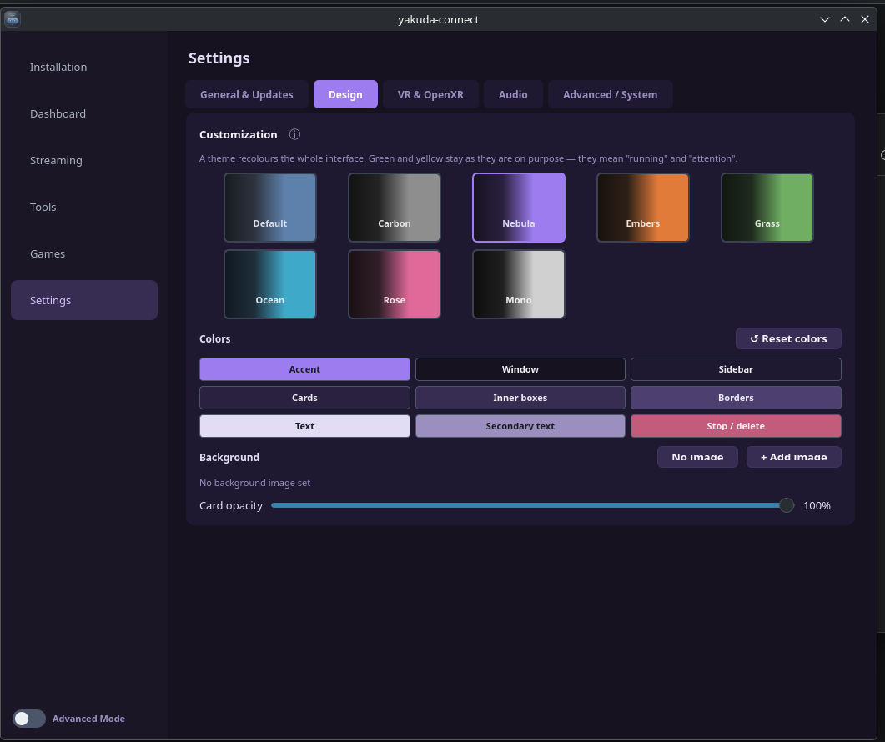
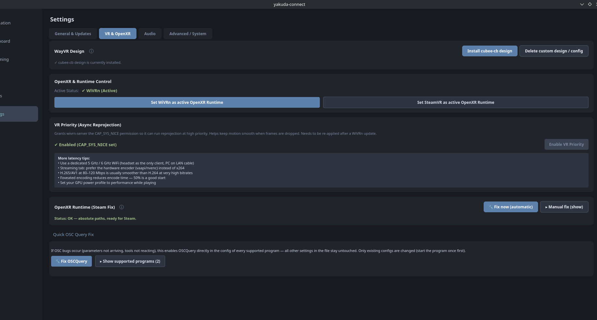
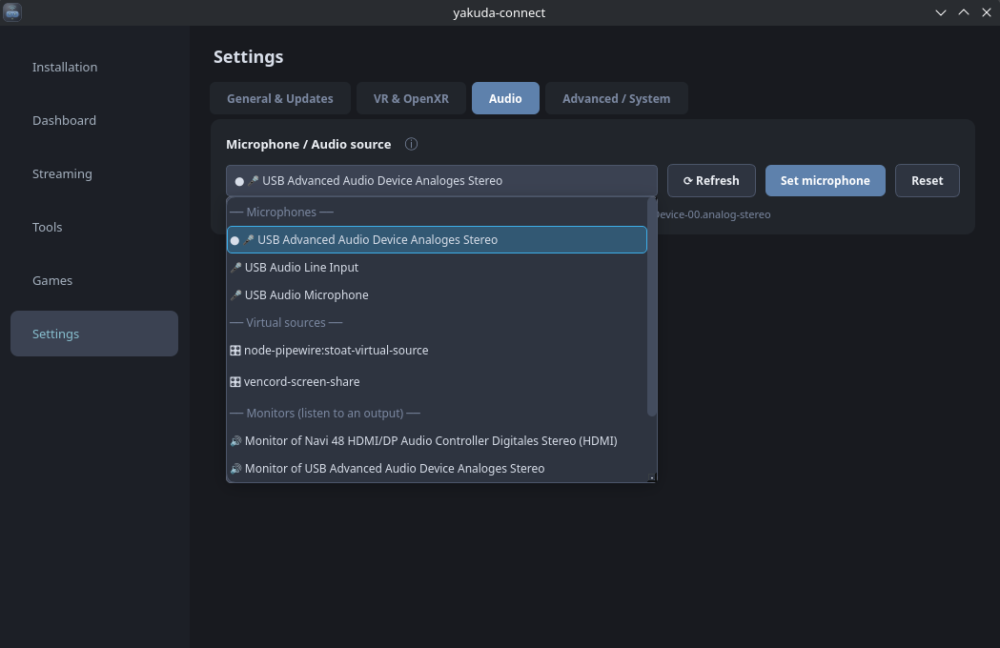

# Screenshots — yakuda-connect

All screenshots of the app (logos and icons not included). · Alle Screenshots der App (ohne Logos und Icons).

1. **Dashboard** · Dashboard — [`dashboard.png`](dashboard.png)

   

2. **Installation** · Installation — [`installation.png`](installation.png)

   

3. **Streaming Settings** · Streaming-Einstellungen — [`streaming.png`](streaming.png)

   

4. **Tools Hub** · Tools — [`tools.png`](tools.png)

   

5. **Games Library** · Spiele-Bibliothek — [`games1.png`](games1.png)

   

6. **Game Settings** · Spiel-Einstellungen — [`games2.png`](games2.png)

   

7. **Controls — Controller View** · Controls — Controller-Ansicht — [`controls1.png`](controls1.png)

   

8. **Controls — Editing Bindings** · Controls — Belegung bearbeiten — [`controls2.png`](controls2.png)

   

9. **General Settings** · Allgemeine Einstellungen — [`settings.png`](settings.png)

   

10. **Advanced Settings** · Erweiterte Einstellungen — [`settings2.png`](settings2.png)

   

11. **Design** · Design — [`design.png`](design.png)

   

12. **Design — Purple Theme** · Design — Lila-Thema — [`lila.png`](lila.png)

   

13. **Audio** · Audio — [`audio.png`](audio.png)

   

14. **Animation** · Animation — [`miau.gif`](miau.gif)

   

---

Controller images for the Controls tab are in [`controls/`](controls/) (replaceable, see the main README). · Die Controller-Bilder für den Controls-Tab liegen in [`controls/`](controls/) (austauschbar, siehe Haupt-README).
